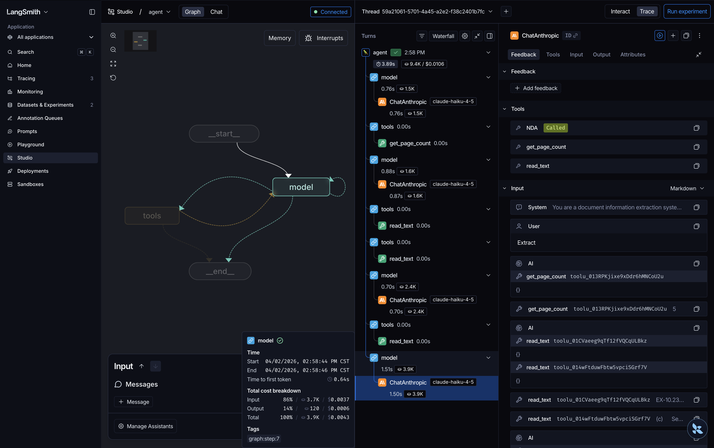

# Contributing

## Development setup

The package requires Python 3.13 or later. Dependencies are managed with [uv](https://docs.astral.sh/uv/).

1. Clone the repository.

```bash
git clone https://github.com/gafnts/agentic-kie.git
cd agentic-kie
```

2. Install all dependencies, dev tools, and git hooks.

```bash
make install
```

3. Create a `.env` file if you need to use API keys.

```bash
cp .env.example .env
```

## Available targets

| Target | Description |
|---|---|
| `make check` | Run the full pre-commit suite (lint, format, type check) |
| `make lint` | Run `ruff check` on `src` and `tests` |
| `make format` | Run `ruff check --fix` on `src` and `tests` |
| `make type` | Run `mypy` on `src` and `tests` |
| `make test` | Run `pytest` with branch coverage |
| `make integration` | Run integration tests only |
| `make langgraph` | Launch LangGraph Studio for interactive graph debugging |

## Debugging with LangGraph Studio

The `make langgraph` target launches [LangGraph Studio](https://github.com/langchain-ai/langgraph-studio) — a visual debugger for the agentic extraction graph. It connects to [LangSmith](https://smith.langchain.com/) and lets you inspect every agent step: model calls, tool invocations, token counts, and latency, all in a single trace view.



This is especially useful for understanding how the agent navigates a document — which pages it reads, in what order, and how many iterations it needs before producing the final extraction.

## CI pipeline

GitHub Actions runs two sequential jobs on every push and pull request to `main`:

1. **`lint-and-type-check`**: runs `pyproject-fmt --check`, `ruff check`, `ruff format --check`, and `mypy`.
2. **`test`**: runs `pytest` with branch coverage and uploads the `coverage.xml` report to Codecov.

Coverage is enforced at 95%.

## Integration tests

The integration workflow is triggered manually via `workflow_dispatch`. It runs `pytest -m integration` against live APIs using the `INTEGRATION_API_KEY` repository secret.

## CD pipeline

Pushing a version tag triggers the CD workflow. It runs four jobs:

1. **`guard`**: verifies the tag points to a commit on `main`.
2. **`lint-and-type-check`** and **`test`** (parallel): same checks as CI.
3. **`publish`**: builds with `uv build`, publishes to [PyPI](https://pypi.org/project/agentic-kie/) via trusted publishing, and creates a GitHub Release with the built distribution files attached.

## Releasing

Releases are driven by git tags. The package version is derived automatically from the tag via [hatch-vcs](https://github.com/ofek/hatch-vcs), so no manual version bumps are needed.

To cut a new release, push a version tag from `main`:

```bash
git tag v1.2.3
git push origin v1.2.3
```
